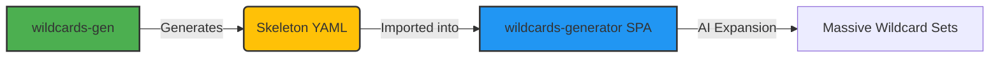

# Wildcards-Gen

**A unified CLI toolkit for generating hierarchical "skeleton" YAML files for AI image generation prompt management.**

This tool combines the precision of **WordNet** (for computer vision datasets) with the creativity of **LLMs** (for semantic categorization) to produce rich, context-aware taxonomies. It is designed to create the "skeleton" files used by the `wildcards-generator` SPA.

> [!TIP]
> **🎯 Looking for the Wildcards Generator SPA?** This CLI tool creates skeleton files for use with [**wildcards-generator**](https://github.com/tazztone/wildcards-generator) — the AI-powered web app that expands these skeletons into massive wildcard libraries.

## 🌟 How It Works

`wildcards-gen` is the **architect**. It builds the structural foundation that other tools populate.



*   **You Provide**: A topic ("Fantasy RPG"), a dataset ("ImageNet"), or a raw list of terms.
*   **We Generate**: A nested YAML file where every category includes an `# instruction:` comment (e.g., "a medieval warrior specialized in melee combat").
*   **The Result**: A context-rich structure specific enough to guide an AI, but broad enough to be populated with thousands of items.

---

## Key Features

### 🚀 Unified Workflow
One tool for all your taxonomy needs. Replaces disparate scripts with a robust CLI and GUI.

### 🧠 Hybrid Intelligence
*   **Dataset Mode (Deterministic)**: Extracts precise hierarchies from **ImageNet**, **COCO**, **Open Images**, and **Tencent ML-Images**. Uses **WordNet glosses** to automatically derive instructions. **(No LLM used, 100% offline & free)**.
*   **LLM Mode (Generative)**: Uses OpenRouter (default: `google/gemma-3-27b-it:free`) to categorize messy lists, create taxonomies from scratch, or "enrich" existing skeletons. **(Requires API Key)**.

### 🛡️ Robust & Verified
*   **Structure Preservation**: Built on `ruamel.yaml` to ensure instructions are never lost.
*   **Deep Hierarchies**: Supports arbitrary nesting depth.

### 🔍 How it generates:
1. **Download**: Grabs raw dataset metadata.
2. **Scan**: Maps IDs to physical names (e.g. "n02121808" -> "lion").
3. **Lookup**: Asks WordNet for a precise definition.
4. **Build**: Constructs a YAML file where every line has a built-in guide.

---

## 🛠️ Configuration

You can configure defaults via `wildcards-gen.yaml` in your project root or `~/.config/wildcards-gen/config.yaml`.

**Example `wildcards-gen.yaml`:**
```yaml
api_key: "sk-or-..."                  # OpenRouter Key
model: "google/gemma-3-27b-it:free"   # LLM Model

paths:
  output_dir: "./output"

generation:
  default_depth: 3
  add_glosses: true

datasets:
  imagenet:
    root_synset: "animal.n.01"        # Default root
```

---

## 📖 Usage Guide & Examples

### 1. Generating form CV Datasets (WordNet)
*Best for: Realistic objects, animals, distinct physical concepts.*

**Scenario: Building a Creature Generator**
You want a massive list of animals, organized scientifically, with descriptions for an AI to use.
```bash
# Generate a hierarchy of all animals, 4 levels deep
wildcards-gen dataset imagenet --root animal.n.01 --depth 4 -o output/creatures.yaml
```

**Scenario: The "Ultimate" Universal Skeleton (Smart Mode)**
You want a single, massive file containing *everything*—objects, scenes, animals, and concepts—hierarchically organized. Using `--smart` mode (recommended) uses WordNet semantics to prune irrelevant nodes and keep meaningful categories.
```bash
# Generate a smart, semantically-pruned skeleton (Recommended)
wildcards-gen dataset tencent --smart -o output/universal_skeleton.yaml
```

#### 🎚️ Tuning Smart Mode
When using `--smart`, you can fine-tune what becomes a category vs. what gets flattened into a list:

| Flag | Default | Effect |
|------|---------|--------|
| `--min-depth` | `6` | Nodes shallower than this in WordNet are always kept as categories. **Lower = fewer top-level categories** |
| `--min-hyponyms` | `10` | Nodes with more descendants than this are kept as categories. **Higher = more flattening** |
| `--min-leaf` | `3` | Minimum items per leaf list. Smaller lists are kept as-is (or merged with `--merge-orphans`) |
| `--merge-orphans` | off | Merge small pruned lists into parent's `misc:` key instead of keeping them |

##### Practical Examples

```bash
# Default: Detailed hierarchy (~10k lines, ~2000 categories)
wildcards-gen dataset tencent --smart -o output/skeleton_detailed.yaml

# Balanced: Good for most use cases (~5k lines, ~500 categories)
wildcards-gen dataset tencent --smart --min-depth 4 --min-hyponyms 50 -o output/skeleton_balanced.yaml

# Flat: Minimal categories, maximum flattening (~2k lines, ~50 categories)
wildcards-gen dataset tencent --smart --min-depth 2 --min-hyponyms 500 --merge-orphans -o output/skeleton_flat.yaml
```

##### Output Comparison

| Preset | `--min-depth` | `--min-hyponyms` | Categories | Lines |
|--------|---------------|------------------|------------|-------|
| Detailed | 6 | 10 | ~2000 | ~10k |
| Balanced | 4 | 50 | ~500 | ~5k |
| Flat | 2 | 500 | ~50 | ~2k |

> [!TIP]
> **Smart Mode** is also available for `imagenet` and `openimages` commands!

### 2. LLM-Powered Creation
*Best for: Abstract concepts, fiction, artistic styles.*

**Scenario: Organizing a Messy List**
You have a text file `artists.txt` with 500 mixed artist names.
```bash
wildcards-gen categorize input/artists.txt -o output/art_styles.yaml
```

**Scenario: Designing a Magic System**
You want to invent a structure for "Magic Spells" from scratch.
```bash
wildcards-gen create --topic "Magic Spells and Incantations" -o output/magic.yaml
```

### 3. Enrichment
*Best for: Fixing generic wildcards.*

**Scenario: Improving Legacy Files**
You have an old YAML file that lacks instructions. The AI generates generic output because it doesn't know what "Synthwave" means.
```bash
# Adds "# instruction: A retro-futuristic aesthetic..." to every key
wildcards-gen enrich old_styles.yaml -o new_styles.yaml
```

### 4. Visual GUI
Prefer clicking? Launch the web interface:

**Linux/macOS:**
```bash
bash scripts/linux/run_gui.sh
```

**Windows:**
```powershell
.\scripts\windows\run_gui.bat
```

Alternatively, if your environment is activated: `wildcards-gen gui`

---

## 🛠️ Installation & Setup

### 🚀 Easy Start (Recommended)
We provide helper scripts that handle virtual environment creation and dependency installation automatically.

**Linux/macOS:**
```bash
bash scripts/linux/install.sh
```

**Windows:**
```powershell
.\scripts\windows\install.bat
```

### 🧠 Quick Universal Skeleton
To generate the recommended "Universal" smart skeleton (based on Tencent ML-Images):

**Linux/macOS:** `bash scripts/linux/gen_universal.sh`
**Windows:** `.\scripts\windows\gen_universal.bat`

---

### Manual Installation
If you prefer to manage your environment manually:

```bash
git clone https://github.com/tazztone/wildcards-gen.git
cd wildcards-gen

# Using uv (recommended)
uv venv .venv
source .venv/bin/activate
uv pip install -e .
```

---

## ❓ Common Questions

**Q: Do I need an API key for everything?**
**A:** No. All `dataset` commands (ImageNet, COCO, etc.) are **completely local and free**. You only need an API key for `create`, `categorize`, and `enrich`.

**Q: What's the difference between a category and a leaf?**
**A:** In the generated YAML:
   - **Categories** are dictionary keys. They get `# instruction:` comments to help the AI understand the context.
   - **Wildcards/Leaves** are list items. These are the actual values the AI will choose from.

**Q: Which LLM should I use?**
**A:** We default to `google/gemma-3-27b-it:free` on OpenRouter, which is very capable and free. If you need more precision for complex categorization, larger models may work better.